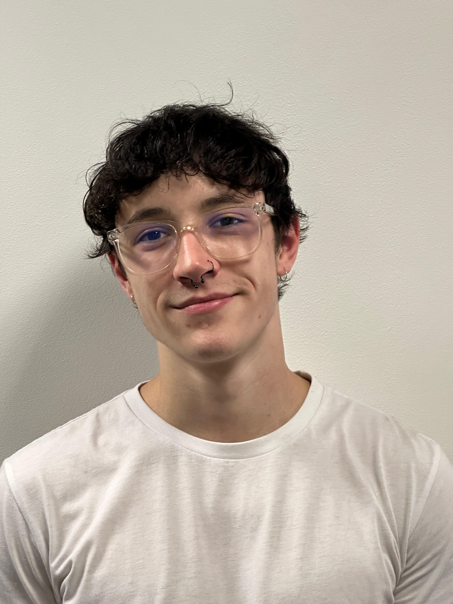
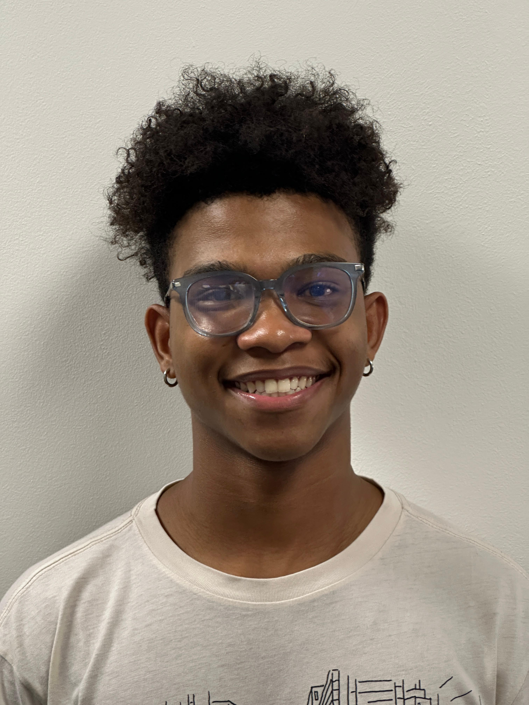

# Twitter clone - By MP-13

<p align="center">
  <a href="https://skillicons.dev">
    
  </a>
</p>

<p align="center">


</p>


# Table of contents

- [Twitter clone - By MP-13](#twitter-clone---by-mp-13)
- [Table of contents](#table-of-contents)
- [Summary](#summary)
- [Introduction](#introduction)
- [Features (a short summary of the user's functionality)](#features-a-short-summary-of-the-users-functionality)
- [Demo Video](#demo-video)
- [Here are the links to our Documentation](#here-are-the-links-to-our-documentation)
- [Our Tech stack](#our-tech-stack)
- [The Version control and CI/CD Utilized](#the-version-control-and-cicd-utilized)
- [Users](#users)
  - [I am just checking out the application](#i-am-just-checking-out-the-application)
  - [I am part of the team](#i-am-part-of-the-team)
  - [I am an external developer and I want to try the app](#i-am-an-external-developer-and-i-want-to-try-the-app)
- [Meet The Team](#meet-the-team)

# Summary
MP-13 is a Twitter clone project aimed at replicating the functionality and user experience of the popular social media platform, Twitter

# Introduction

<details>
<summary>introduction - click to expand</summary>
MP-13 is a Twitter clone project aimed at replicating the functionality and user experience of the popular social media platform, Twitter. This application serves as a platform for users to engage in real-time conversations, share updates, and connect with others globally. With a focus on mirroring Twitter's core features such as posting tweets, following other users, and receiving notifications, MP-13 aims to provide users with a familiar and seamless social networking experience.

Designed to cater to a wide range of users, MP-13 offers a user-friendly interface and intuitive navigation, ensuring accessibility for both novice and experienced social media users. Whether users are seeking to share their thoughts, discover trending topics, or engage with like-minded individuals, MP-13 provides a dynamic platform for fostering connections and facilitating meaningful interactions. With its robust functionality and commitment to user satisfaction, MP-13 emerges as a compelling alternative to existing social media platforms, promising a vibrant and engaging online community experience.

As a testament to its dedication to innovation and user-centric design, MP-13 continually evolves to incorporate new features and enhancements based on user feedback and emerging trends in social media. With a mission to empower users to express themselves freely and connect with others in a safe and inclusive environment, MP-13 stands as a beacon of digital connectivity and social interaction in the ever-expanding landscape of online networking platforms.

To learn more about this project see our documentation [Here are the links to our Documentation](#here-are-the-links-to-our-documentation)
</details>

# Features (a short summary of the user's functionality)

<details>
<summary>Features (a short summary of the user's functionality) - click to expand</summary>
MP-13 offers a comprehensive set of features designed to enhance the user experience and foster meaningful interactions within its community. Users can seamlessly engage with the platform through various functionalities, including:

1. Posting Tweets: Users can share their thoughts, updates, and multimedia content with their followers through the posting of tweets.

2. Social Networking: MP-13 enables users to connect with others by following their profiles, receiving updates from followed accounts, and engaging in conversations through likes, comments, and retweets.

3. Personalized Experience: The platform allows users to customize their profiles, manage privacy settings, and curate their timelines to tailor their experience according to their preferences.

4. Discovery and Trending Topics: Users can explore trending topics, discover new accounts to follow, and engage with popular conversations to stay informed and connected with the latest trends.

5. Notifications: MP-13 provides real-time notifications for interactions such as likes, comments, mentions, and new followers, ensuring users stay updated and engaged with their network.

6. Search Functionality: Users can easily search for specific content, hashtags, users, or topics of interest, facilitating discovery and access to relevant information within the platform.

With these features and more, MP-13 offers a dynamic and immersive social networking experience, empowering users to express themselves, connect with others, and stay informed within a vibrant online community.
</details>

# Demo Video
<p align="center">
<a href="https://www.youtube.com/watch?v=_SxSVuEryPU">Demo 1</a><br>
<a href="">Demo 2</a><br>
</p>

# Here are the links to our Documentation

<p align="center">
<a href="https://drive.google.com/drive/u/2/folders/12w9AqPrPh--GmyGXWzAQYP414YTrQfHA">Google Drive (For Dev purposes)</a><br>
<a href="https://docs.google.com/document/d/13-FlGpf09eMM-dNkEyX95V4DfcYBMRBgIdHgMGPqi2o/edit?usp=sharing">System Requirements (SRS)</a><br>
<a href ="https://docs.google.com/document/d/1G1Gdibt_B2mFnmy8S8u-i7FS6X7fMDLiE49PROLf4pY/edit?usp=sharing">System Architecture Design</a><br>
<a href="https://docs.google.com/document/d/15hG2OY6oi2Lvb1nx3eZkLjZcsis7eU1H7L7xb3rV1OU/edit?usp=sharing">Project Plan</a><br>
<a href ="https://docs.google.com/document/d/11aLnvSpC1LST7BpA-j2aYu5DllywdCPte29lN52R7SM/edit?usp=sharing">Github Strategy</a><br>
<a href ="https://docs.google.com/document/d/1pjID6P7Bm5cW-CHl8nykfEDVZW__pZilfMokT4Z0OtE/edit?usp=sharing">Coding Development Guidelines</a><br>
<a href ="https://docs.google.com/document/d/10wjOA4YQwbv8rrY7VAZbGI7kNGU068dD_kCcFyz7TNM/edit?usp=sharing">Database Requirements</a><br>
<a href ="https://docs.google.com/document/d/1kqSZR3lpSLi-COQGo9uN9eQ1im35OKx1a0JLmobBb-M/edit?usp=sharing">Design Specification</a><br>
<a href="https://www.figma.com/file/w0aRTpe5SPT38VwPLuGaFK/COS301-MP-13?type=design&node-id=333%3A2&mode=design&t=Zq1dr1WePO4TwN30-1">Figma designs</a><br>
<a href="https://github.com/orgs/COS301-SE-2024/projects/37">GitHub Project Board</a><br>
<a href="https://docs.google.com/document/d/1VsK2jxQTtA9ZZIZX_dhPFOpS2-zdkvMv/edit?usp=sharing&ouid=101397220993474127366&rtpof=true&sd=true">Testing Guidelines</a><br>
</p>

# Our Tech stack

<p align="center">
  <a href="https://skillicons.dev">
    
  </a>
</p>

# The Version control and CI/CD Utilized

<p align="center">
  <a href="https://skillicons.dev">
    
  </a>
</p>

# Users

## I am just checking out the application

Please navigate to <a href="https://mini-project13.vercel.app/">twitter clone</a> to use the application

## I am part of the team

Please see <a href="CONTRIBUTING.md">contributing</a> for more details on how you can contribute to this repo

## I am an external developer and I want to try the app

1. Clone the repository.
2. Configure and install the dependencies:

```
npm install
```

3. Start up a development server and navigate to the appropriate port:

```
npm run dev
```

4. To close the development server run
   `CTRL-C`
5. To run tests, run

```
npm test
```

# Meet The Team

| Name and Surname             | Github Profiles                                                                                           | LinkedIn Profile                                 | Roles                  | Bio                                                                                                                                                                                                                                                                                                                                                                                                                                                             | Profile Image                                                                |
| :--------------------------- | --------------------------------------------------------------------------------------------------------- | -------------------------------------------------------------------------------------------------------------- | :--------------------- | :-------------------------------------------------------------------------------------------------------------------------------------------------------------------------------------------------------------------------------------------------------------------------------------------------------------------------------------------------------------------------------------------------------------------------------------------------------------- | ---------------------------------------------------------------------------- |
| Tessa Engelbrecht            | <a href=""> </a>                            | [LinkedIn](https://www.linkedin.com/in/tessa-engelbrecht/)                                                    | Project Manager        | As a project manager, I thrive on building strong relationships with my team members. My passion lies in getting to know each individual's strengths and working collaboratively to leverage those talents effectively. I prioritise regular team meetings to ensure clear communication, alignment, and understanding of expectations.                                                                                                                         |                       |
| Kumbirai Shonhiwa            | <a href=""></a>                             | [LinkedIn](www.linkedin.com/in/kumbirai-aris-9052462b7)                                                    | Business Analyst       | Passionate about web design                                                                                                                                                                                                                                                                                                                                                                                                                                     |                        |
| Kyle Marshall                | <a href=""></a>                             | [LinkedIn]([https://www.linkedin.com/in/kyle-marshall/](https://www.linkedin.com/in/kyle-marshall23?utm_source=share&utm_campaign=share_via&utm_content=profile&utm_medium=ios_app))                                                        | Designer               | Hi, I am Kyle Marshall! As a dedicated designer, I bring a keen eye for beauty, aesthetics and professionalism to every project. Currently pursuing my third year in Computer Science, I leverage my technical knowledge to enhance my design work. Specializing in UX/UI design, I'm passionate about crafting intuitive user experiences that seamlessly blend form and function.                                                                             |                        |
| Yashvitha Kanaparthy         | <a href=""></a>                             | [LinkedIn](https://www.linkedin.com/in/yashvitha-kanaparthy-501657174/)                                     | UI Engineer            | I'm a passionate UI engineer deeply immersed in the world of creative design and user experience. With a strong background in Computer Science, currently in my third year of study, I excel in designing user-friendly digital interfaces that skillfully merge aesthetics with functionality. With a keen eye for detail and a commitment to innovation, I'm dedicated to creating captivating experiences that resonate with users across diverse platforms. |                        |
| Quintin D'hotman de Villiers | <a href=""></a>                             | [LinkedIn](https://www.linkedin.com/in/quintin-d-hotman-de-villiers-1562a2165/)                             | Integration Engineer   | Enthusiastic about automation                                                                                                                                                                                                                                                                                                                                                                                                                                   |                        |
| Kamogelo Moeketse            | <a href=""></a>                             | [LinkedIn](https://www.linkedin.com/in/kamogelo-moeketse-63b650137/)                                         | Data Engineer          | Analyzing data is my passion                                                                                                                                                                                                                                                                                                                                                                                                                                    |                        |
| Dhinaz Rangasamy             | <a href=""></a>                             | [LinkedIn](https://www.linkedin.com/in/dhinaz-rangasamy-5a7158109/)                                          | Architect              | Bridging technology and business                                                                                                                                                                                                                                                                                                                                                                                                                                |                        |
| Given Chauke                 | <a href=""></a>                             | [LinkedIn](https://www.linkedin.com/in/given-chauke-654472150/)                                              | Services Engineer      | Life long learner who enjoys challenges and building useful software products. Interested in gaming 🎮 and board games ♟                                                                                                                                                                                                                                                                                                                                       |                        |
| Dominique Da Silva           | <a href="https://github.com/Dominique-Da-Silva"></a>                             | [LinkedIn]([https://www.linkedin.com/in/dominique-da-silva-6019b11a5/](https://www.linkedin.com/in/DominiqueDaSilva/))                                        | Services Engineer      | Ensuring software quality                                                                                                                                                                                                                                                                                                                                                                                                                                       |                        |
| Alex Pretorius               | <a href=""></a>                             | [LinkedIn](https://www.linkedin.com/in/alex-pretorius-18420410b/)                                             | Testing Engineer       | Crafting elegant software solutions                                                                                                                                                                                                                                                                                                                                                                                                                             |                        |
| Michael Chinyama             | <a href="https://waveyboym.github.io/"></a> | [LinkedIn](https://www.linkedin.com/in/michael-chinyama-28a4041a8/)                                          | DevOps, CI/CD Engineer | Interested in computer science and creating fun CS related projects                                                                                                                                                                                                                                                                                                                                                                                             |  |
